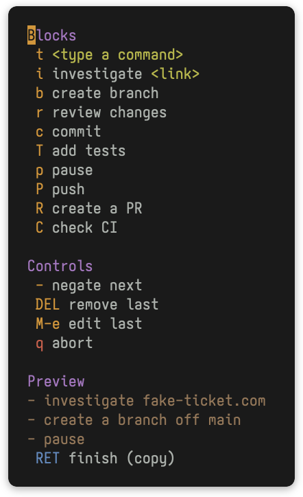

<div align="center">
  

# promptu

Compose LLM prompts from building blocks, using a convenient transient menu interface!

*The opposite of 'impromptu': composed, not off-the-cuff.*


</div>

## Usage

```
M-x promptu
```

Pick building blocks one at a time. The menu stays open and shows a live preview
as the prompt is built.

Press `RET` to copy the composed prompt to the kill ring, then paste it into
your agent (e.g. `agent-shell`) or anywhere else.

### Basic Keys

| Key       | Action                                               |
|-----------|------------------------------------------------------|
| _block_   | Add that block to the prompt                         |
| `-`       | The next block added is negated                      |
| `DEL`     | Remove the last entry (or the entry above the point) |
| `M-e`     | Edit the last entry (or the entry above the point)   |
| `RET`     | Finish: copy the composed prompt to the kill ring    |
| `C-g`     | Abort with no output                                 |

The full set of keys is shown in the transient menu, and should be discoverable
and self-explanatory.

### The point

Initially the point is not visible and new blocks are appended to the end of the
prompt.  To edit/remove earlier blocks, `C-p`/`C-n` can be used to move the
point (it then shows as a `▮` in the preview).

### Editing the whole prompt

`M-e` and `DEL` act on a single entry at a time.  To work on the prompt as a
whole, press `M-E` to open the whole prompt in a buffer as free text.

**Note:** Saving replaces the prompt with the buffer's contents as a single
free-text entry, kept exactly as typed.  The previous block-by-block breakdown
is discarded.  That entry is shown in a distinct color in the preview (see
`promptu-free-text-face`) so it's clear that part is one free-form region rather
than separate blocks.

### Undo

`C-/` undoes the last change to the prompt and `C-M-/` redoes it.

### History

Inside the menu, step back through past finished prompts with `M-p` / `M-n` like
shell history, or browse them with `M-r`.

To grab a past prompt without opening the menu:

```
M-x promptu-recall
```

It picks a past prompt and copies it straight to the kill ring.

## Example

Pressing `r c - P` triggers the built-in blocks `review`, `commit`, then arms
`-` and adds a negated `push`. This composes (with the default separator) a
bulleted list:

```
- review your changes
- commit
- don't push
```

## Installation

Clone and load:

```elisp
(use-package promptu
  :load-path "~/.emacs.d/packages/promptu"
  :bind ("s-;" . promptu))
```

## Customization

```elisp
(setq promptu-blocks
      '((:key "r" :desc "review"      :text "review your changes")
        (:key "c" :desc "commit"      :text "commit")
        (:key "t" :desc "add tests"   :text "add tests" :negative "skip the tests")
        (:key "p" :desc "push"        :text "push when done")
        (:key "i" :desc "investigate" :text "investigate {link}" :placeholders ("link"))))
```

This replaces the built-in set. To instead add to it, append to
`promptu-default-blocks`:

```elisp
(setq promptu-blocks
      (append promptu-default-blocks
              '((:key "d" :desc "deploy" :text "deploy"))))
```

Each block is a plist:

- `:key`: the transient trigger key. Avoid the reserved menu-control keys; see
  `promptu--reserved-keys`.
- `:desc`: the short menu description.
- `:text`: the affirmative text; may contain named placeholders as `{name}`.
- `:negative`: optional text emitted when the block is negated.
- `:placeholders`: optional list of placeholder names prompted for on add.

Other options:

- `promptu-separator` (default `"\n- "`): placed between blocks. When it
  contains a newline, its trailing line prefix is also applied to the first
  block, so the default produces a fully bulleted list.
- `promptu-negation-prefix` (default `"don't "`): used for negated blocks
  with no explicit `:negative` text.
- `promptu-history-max` (default `50`): how many past prompts to keep. Set to
  `nil` for unbounded history.
- `promptu-history-file` (default `nil`): where to persist history. When `nil`,
  history lives only in the current Emacs session, like the kill ring.

### Loading blocks from JSON

The block list can also live in a JSON file, useful for sharing it with
other promptu frontends:

```elisp
(setq promptu-blocks
      (promptu-blocks-from-json "~/.config/promptu/blocks.json"))
```

The file holds an array of objects mirroring the plist keys:

```json
[
  { "key": "r", "desc": "review", "text": "review your changes" },
  { "key": "i", "desc": "investigate", "text": "investigate {link}", "placeholders": ["link"] },
  { "key": "P", "desc": "push", "text": "push when done", "negative": "don't push" }
]
```

### Persisting history across sessions

History is in-memory by default. To keep it across Emacs restarts, point
`promptu-history-file` at a file:

```elisp
(setq promptu-history-file
      (expand-file-name "promptu-history.el" user-emacs-directory))
```

It is loaded on first use and saved after each finished prompt.

**Note:** composed prompts can include values you typed for placeholders, so
enabling this writes those values to the file in plain text.

## Dependencies

Emacs 28.1+ and `transient` 0.5.0+. Nothing else.

`transient` ships with Emacs, but Emacs 28/29 bundle a version older than
0.5.0. On those, install a newer `transient` from GNU ELPA (`M-x
package-install RET transient RET`).

## Related

- [context-clues](https://github.com/mrcnski/context-clues): a sibling
  transient menu for copying file, buffer, and code context to the kill ring.

## License

GPL-3.0-or-later.
